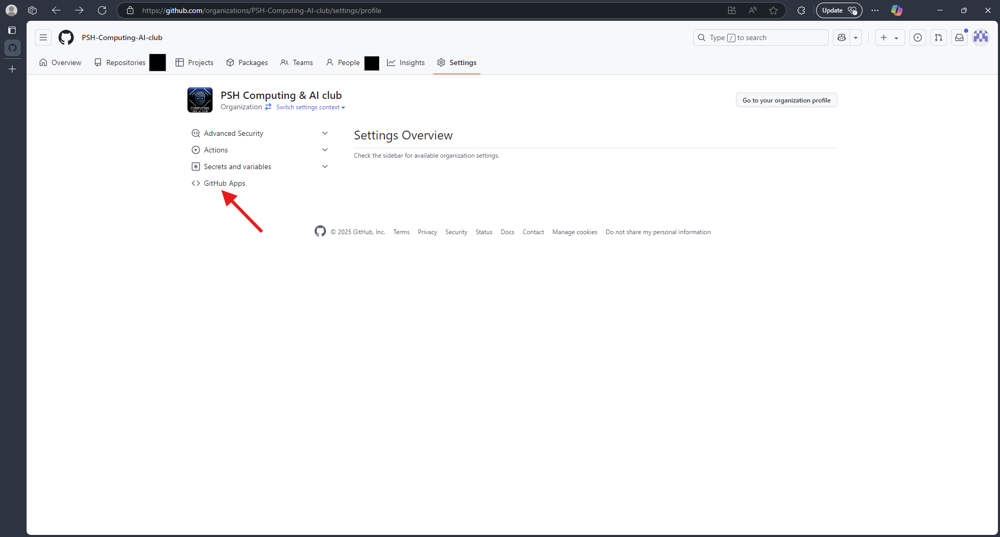

<div align="center">


# Bracket Runner

Runner system for managing the lifecycle of cloning, running, and then generating HTML visualization of a tournament bracket.

</div>

## Installation

Download and install version `v2.1.4` or later of the [Deno JavaScript runtime](https://deno.com).

Then run `deno task deps:cache` in a terminal.

## Usage

### Competitor Manifest

Competitors participating in the bracket are found in the [`./competitors.json`](./competitors.json) manifest file.

The manifest file is an array containing objects of each individual competitor. The only details needing filled out are the competitor's name and the URL to their GitHub repository:

```json
[
    {
        "name": "Competitor Name Here",
        "url": "https://github.com/.../..."
    },

    ...
]
```

### Clone Competitor Repositories

> **NOTE:** You need read access to the repositories listed in the competitor manifest.

To clone the repositories of the competitors found in the competitor manifest type `deno task bracket:clone` in a terminal.

The repositories will be cloned to the `./competitors/` directory.

### Run Bracket

> **NOTE:** You need the Linux version of the [Dots and Boxes game engine](https://github.com/PSH-Computing-AI-club/competition-spring-2025-dotsandboxes) downloaded into the `./.bin` directory.

> **NOTE:** You need internet access for the first time you run a simulation so [`deno_emit`](https://github.com/denoland/deno_emit) can download its payload.

> **WARNING:** Brackets need to have powers of 2 amount of competitors in the manifest. If there are not enough competitors, please use the placeholder repository to fill missing slots.

To run a tournament bracket of the configured competitors type `deno task bracket:run` in a terminal.

The results will be written to the `./dist/output/YYYY-MM-DD.RUNNUMBER/` directory. You can calculate `RUNNUMBER` by the following expression: `floor(currentHour / (24 hoursPerDay / 6 runsPerDay))`.

### Generate HTML Visualization

To generates HTML visualization of tournament results type `deno task bracket:visualize` in a terminal.

The results will be written to the `./dist/html/` directory.

## Practice Brackets

During the practice tournament brackets timeframe, Bracket Runner will automatically be run by [GitHub Actions](./.github/workflows/practice-brackets.yaml) every day, six times a day.

The HTML visualized results will automatically be published to [GitHub Pages](https://psh-computing-ai-club.github.io/competition-spring-2025-bracket) after every run.

## Automated Tournament Practice Brackets via GitHub Actions

Automated tournament brackets are ran through the [`./.github/workflows/practice-brackets.yaml`](./.github/workflows/practice-brackets.yaml) file. Several things need to be configured / enabled for the automated system to work.

### Enabling GitHub Actions for the Repository

GitHub Actions needs to be enabled for the repository.

1. Go to the "Settings" tab of the repository:


2. Then switch to the "Actions" menu:


3. Finally enable "Allow all actions and reusable workflows" and hit the "Save" button:


### Giving Permission to Competitor Repositories

The automated tournament workflow needs to be given permissions to access competitor repositories found in the manifest.

1. Go to the club's organization page and hit the "Settings" tab:


2. Then switch to the "GitHub Apps" menu:



3. Hit the "Edit" button for the "competition-spring-2025-access" GitHub App:


4. Then switch to the "Install App" sub menu:


5. Hit the cog icon to go to the list of repositories installed with the GitHub App:


6. Select the repositories of the competitors that are registered in the [`./competitors.json`](./competitors.json) manifest file.


7. Repeat as new competitors sign up for the tournament.

## License

The Bracket Runner game engine is [licensed](./LICENSE) under the MIT License.

## Related Repositories

- [`github.com/PSH-Computing-AI-club/competition-spring-2025`](https://github.com/PSH-Computing-AI-club/competition-spring-2025)

- [`github.com/PSH-Computing-AI-club/competition-spring-2025-dotsandboxes`](https://github.com/PSH-Computing-AI-club/competition-spring-2025-dotsandboxes)

- [`github.com/PSH-Computing-AI-club/competition-spring-2025-dotsandboxes-template-javascript`](https://github.com/PSH-Computing-AI-club/competition-spring-2025-dotsandboxes-template-javascript)

- [`github.com/PSH-Computing-AI-club/competition-spring-2025-dotsandboxes-template-typescript`](https://github.com/PSH-Computing-AI-club/competition-spring-2025-dotsandboxes-template-typescript)

- [`github.com/PSH-Computing-AI-club/competition-spring-2025-placeholder-competitor`](https://github.com/PSH-Computing-AI-club/competition-spring-2025-placeholder-competitor)
